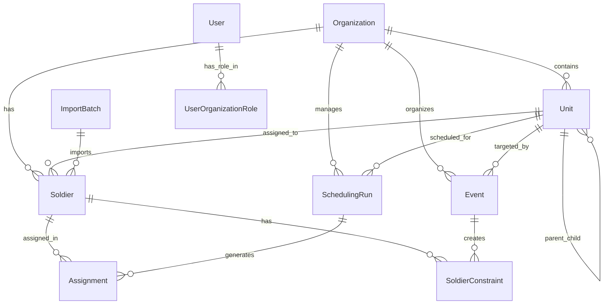

# Military Scheduling System

## Overview

This is a Django-based military scheduling system that uses advanced constraint programming to generate optimal duty schedules for soldiers. The system employs Google OR-Tools to solve complex scheduling problems while maintaining fairness, balance, and operational requirements.

## 🏗️ Project Architecture & Data Structure

### Core Components

```
schedule_manage/
├── manage.py                   # Django management script
├── schedule_manage/            # Django project settings
│   ├── settings.py            # Main configuration
│   ├── urls.py                # URL routing
│   ├── wsgi.py                # Web server interface
│   └── asgi.py                # ASGI configuration
├── schedule/                   # Main application
│   ├── models.py              # Database models
│   ├── views.py               # API endpoints
│   ├── serializers.py         # API serialization
│   ├── urls.py                # App URL patterns
│   ├── admin.py               # Django admin interface
│   ├── tasks.py               # Background tasks
│   ├── algorithms/            # Scheduling algorithm engine
│   │   ├── solver.py          # Main algorithm engine
│   │   ├── variables.py       # Decision variables
│   │   ├── objective.py       # Optimization objectives
│   │   ├── config.py          # Algorithm parameters
│   │   ├── utils.py           # Utility functions
│   │   ├── analysis.py        # Problem analysis
│   │   ├── constraints/       # Constraint modules
│   │   │   ├── basic.py       # Core constraints
│   │   │   ├── consecutive.py # Work pattern constraints
│   │   │   ├── daily_requirements.py # Staffing constraints
│   │   │   ├── balance.py     # Fairness constraints
│   │   │   ├── blocks.py      # Block constraints
│   │   │   ├── advanced.py    # Advanced constraints
│   │   │   └── minimum_work.py # Minimum work constraints
│   │   └── exporters/         # Export functionality
│   │       ├── excel.py       # Excel export
│   │       └── json.py        # JSON export
│   └── migrations/            # Database migrations
├── requirements.txt           # Python dependencies
├── db.sqlite3                 # SQLite database
├── logs/                      # Application logs
└── venv/                      # Virtual environment
```

### Database Models & Relationships



## 🎯 Core Algorithm Explanation

### The Problem
Military units need to assign soldiers to base duty and home leave in a way that:
- Ensures minimum staffing levels are met daily
- Distributes workload fairly among all personnel  
- Respects individual constraints (medical leave, personal days off)
- Maintains operational readiness
- Balances consecutive work/leave periods

### The Solution: Constraint Programming

The system uses **Constraint Programming (CP)** via Google OR-Tools to model this as a constraint satisfaction problem:

#### 1. **Variables**
- `x[soldier][day]` = Binary variable (1 if soldier is on base, 0 if at home)
- Each soldier gets a binary decision for each day in the scheduling period

#### 2. **Core Constraints**

**Daily Staffing Requirements:**
```python
# Ensure minimum soldiers on base each day
sum(x[soldier][day] for all soldiers) >= min_required_soldiers_per_day
```

**Individual Workload Balance:**
```python
# Each soldier gets target number of base/home days
sum(x[soldier][day] for all days) == target_base_days_per_soldier
```

**Consecutive Work Limits:**
```python
# Prevent excessive consecutive base days
for any consecutive_days <= max_consecutive_base_days
```

**Personal Constraints:**
```python
# Respect individual unavailable dates
if soldier has constraint on day: x[soldier][day] = 0
```

#### 3. **Optimization Objectives**

The algorithm optimizes multiple objectives simultaneously:

**Primary: Operational Requirements**
- Meet daily minimum staffing (hard constraint)
- Distribute exceptional soldiers (leaders) evenly across days
- Apply event-specific parameters when `override_global_settings=True`

**Secondary: Fairness & Quality of Life**
- Balance total base days among all soldiers
- Minimize consecutive work periods
- Respect weekend preferences for eligible soldiers
- Honor individual constraints and requests

**Event-Specific Optimization:**
When events have custom parameters, the algorithm:
1. **Parameter Inheritance**: Uses event parameters instead of global defaults
2. **Constraint Override**: Applies stricter or more relaxed rules per event
3. **Multi-Event Coordination**: Balances conflicting requirements across overlapping events
4. **Priority Handling**: Higher priority events take precedence in parameter conflicts

### Algorithm Flow

```
1. DATA PREPARATION
   ├── Load soldiers and their constraints
   ├── Calculate target base/home days per soldier
   └── Set scheduling period (start_date to end_date)

2. CONSTRAINT MODEL CREATION
   ├── Create binary variables for each soldier-day combination
   ├── Add daily staffing constraints
   ├── Add individual workload constraints
   ├── Add consecutive work limit constraints
   └── Add personal constraint restrictions

3. OBJECTIVE OPTIMIZATION
   ├── Primary: Satisfy all hard constraints
   ├── Secondary: Minimize workload variance between soldiers
   ├── Tertiary: Optimize consecutive work patterns
   └── Quaternary: Respect preferences when possible

4. SOLUTION GENERATION
   ├── Invoke OR-Tools CP-SAT solver
   ├── Find optimal solution balancing all objectives
   └── Extract daily assignments for each soldier

5. RESULT VALIDATION
   ├── Verify all constraints are satisfied
   ├── Calculate fairness metrics
   └── Generate assignment records
```

## 🏗️ System Architecture

### Core Components

**Models (`schedule/models.py`)**
- `Soldier`: Personnel data with flags for exceptional/weekend-only roles
- `SoldierConstraint`: Individual unavailable dates and reasons
- `Event`: Training events and special operations
- `SchedulingRun`: Algorithm execution with parameters and results
- `Assignment`: Final daily soldier assignments (base/home)

**Algorithm Engine (`schedule/algorithms/`)**
- `solver.py`: Main OR-Tools constraint solver
- `variables.py`: Decision variable creation and management
- `constraints/`: Modular constraint implementations
  - `basic.py`: Core staffing and workload constraints
  - `consecutive.py`: Consecutive work period limits
  - `daily_requirements.py`: Daily minimum staffing
  - `balance.py`: Fairness and workload distribution
- `objective.py`: Multi-objective optimization functions

**API Layer (`schedule/views.py`)**
- RESTful endpoints for data management
- Schedule generation triggers
- Real-time algorithm status monitoring

### Data Flow

```
Input Data → Constraint Model → OR-Tools Solver → Optimal Schedule → Database Storage
     ↓              ↓                ↓                  ↓              ↓
  Soldiers    Binary Variables   CP-SAT Algorithm   Assignments    Results API
 Constraints  Constraint Rules   Objective Function  Validation    Web Interface
```

## 🚀 Installation & Setup

### Prerequisites
```bash
# Core dependencies
pip install django djangorestframework ortools pandas numpy openpyxl
```

### Quick Start
```bash
# 1. Clone and navigate to project
cd schedule_manage

# 2. Create virtual environment (recommended)
python -m venv venv
source venv/bin/activate  # Linux/Mac
# venv\Scripts\activate     # Windows

# 3. Install dependencies
pip install django djangorestframework ortools pandas numpy openpyxl

# 4. Setup database
python manage.py makemigrations
python manage.py migrate

# 5. Create admin user
python manage.py createsuperuser

# 6. Start server
python manage.py runserver

# 7. Access interfaces
# API Root: http://localhost:8000/api/
# Admin: http://localhost:8000/admin/
```

## 📋 Data Model Details

### 1. Organization
**Purpose**: Top-level container for military units and personnel
**Fields**:
- `name`: Organization name (e.g., "1st Infantry Division")
- `code`: Unique organization code (e.g., "1ID")
- `description`: Optional description
- `contact_email`, `contact_phone`, `address`: Contact information

### 2. Unit
**Purpose**: Hierarchical military units (Battalion → Company → Platoon → Squad)
**Fields**:
- `name`: Unit name (e.g., "Alpha Company")
- `code`: Unit code (e.g., "A-CO")
- `unit_type`: One of [ORGANIZATION, BATTALION, COMPANY, PLATOON, SQUAD, TEAM, DEPARTMENT, DIVISION, CUSTOM]
- `parent_unit`: Reference to parent unit (null for top-level)
- `organization`: Reference to owning organization
- `commander`: Unit commander name
- `default_min_soldiers_per_day`: Default staffing requirement

### 3. Soldier
**Purpose**: Individual personnel with scheduling properties
**Key Fields**:
- `name`: Soldier name
- `soldier_id`: Unique identifier
- `rank`: Military rank
- `organization`, `unit`: Organizational assignment
- `is_exceptional_output`: Leadership role flag (distributed evenly)
- `is_weekend_only_soldier_flag`: Weekend-only assignment flag
- `status`: One of [ACTIVE, INACTIVE, ON_LEAVE, TRANSFERRED, DISCHARGED]

### 4. SoldierConstraint
**Purpose**: Individual unavailability periods
**Fields**:
- `soldier`: Reference to soldier
- `constraint_date`: Date unavailable
- `description`: Reason (e.g., "Medical appointment", "Leave")
- `constraint_type`: One of [PERSONAL, MEDICAL, TRAINING, FAMILY, OFFICIAL, OTHER]

### 5. Event
**Purpose**: Special operations or training with custom scheduling parameters
**Key Features**:
- Can target specific units or individual soldiers
- `override_global_settings`: Enable custom parameters
- Custom scheduling parameters (when override enabled):
  - `base_days_per_soldier`, `home_days_per_soldier`: Custom targets
  - `max_consecutive_base_days`, `max_consecutive_home_days`: Consecutive limits
  - `min_base_block_days`: Minimum work block size
  - `require_weekend_coverage`: Weekend requirements
  - `balance_workload`: Enable workload balancing

### 6. SchedulingRun
**Purpose**: Algorithm execution with specific parameters
**Fields**:
- `start_date`, `end_date`: Scheduling period
- `target_units`: Units to include in scheduling
- Scheduling parameters:
  - `default_base_days_target`: Target base days per soldier
  - `default_home_days_target`: Target home days per soldier
  - `max_consecutive_base_days`: Maximum consecutive work days
  - `min_required_soldiers_per_day`: Daily minimum staffing
- `status`: One of [PENDING, IN_PROGRESS, SUCCESS, FAILURE, NO_SOLUTION, CANCELLED]

### 7. Assignment
**Purpose**: Final daily soldier assignments
**Fields**:
- `scheduling_run`: Reference to scheduling run
- `soldier`: Reference to soldier
- `assignment_date`: Assignment date
- `is_on_base`: True if on base, False if at home

## 🔗 Complete API Reference

### Base URL
```
http://localhost:8000/api/
```

### 1. Organizations API
**List Organizations**
```bash
GET /api/organizations/
```

**Create Organization**
```bash
POST /api/organizations/
{
    "name": "1st Infantry Division",
    "code": "1ID",
    "description": "First Infantry Division",
    "contact_email": "admin@1id.mil",
    "contact_phone": "+1-555-0100"
}
```

**Get Organization Statistics**
```bash
GET /api/organizations/{id}/statistics/
# Returns: units_count, soldiers_count, recent_imports, active_schedules
```

### 2. Units API
**List Units**
```bash
GET /api/units/
GET /api/units/?organization=1         # Filter by organization
GET /api/units/?unit_type=COMPANY      # Filter by type
GET /api/units/?parent_unit=1          # Filter by parent
GET /api/units/?top_level=true         # Only top-level units
```

**Create Unit**
```bash
POST /api/units/
{
    "name": "Alpha Company",
    "code": "A-CO",
    "unit_type": "COMPANY",
    "organization_id": 1,
    "parent_unit_id": 2,
    "commander": "Captain Smith",
    "default_min_soldiers_per_day": 10
}
```

**Get Unit Soldiers**
```bash
GET /api/units/{id}/soldiers/
# Returns all soldiers in unit and sub-units
```

**Bulk Create Soldiers for Unit**
```bash
POST /api/units/{id}/bulk_create_soldiers/
[
    {
        "name": "John Doe",
        "soldier_id": "12345",
        "rank": "PRIVATE",
        "is_exceptional_output": false,
        "is_weekend_only_soldier_flag": false
    },
    {
        "name": "Jane Smith",
        "soldier_id": "12346",
        "rank": "CORPORAL",
        "is_exceptional_output": true,
        "is_weekend_only_soldier_flag": false
    }
]
```

### 3. Soldiers API
**List Soldiers**
```bash
GET /api/soldiers/
GET /api/soldiers/?organization=1      # Filter by organization
GET /api/soldiers/?unit=2              # Filter by unit
GET /api/soldiers/?status=ACTIVE       # Filter by status
```

**Create Soldier**
```bash
POST /api/soldiers/
{
    "name": "John Doe",
    "soldier_id": "12345",
    "rank": "PRIVATE",
    "organization_id": 1,
    "unit_id": 2,
    "email": "john.doe@example.com",
    "phone": "+1-555-0123",
    "is_exceptional_output": false,
    "is_weekend_only_soldier_flag": false,
    "status": "ACTIVE"
}
```

### 4. Soldier Constraints API
**Add Constraint**
```bash
POST /api/soldier-constraints/
{
    "soldier": 1,
    "constraint_date": "2025-09-15",
    "description": "Medical appointment",
    "constraint_type": "MEDICAL"
}
```

**List Constraints**
```bash
GET /api/soldier-constraints/
GET /api/soldier-constraints/?soldier=1           # Filter by soldier
GET /api/soldier-constraints/?unit=2              # Filter by unit
GET /api/soldier-constraints/?constraint_type=MEDICAL  # Filter by type
GET /api/soldier-constraints/?start_date=2025-07-25&end_date=2025-09-18  # Date range
```

### 5. Events API
**Create Event**
```bash
POST /api/events/
{
    "name": "Special Training Exercise",
    "event_type": "TRAINING",
    "start_date": "2025-09-01",
    "end_date": "2025-11-01",
    "description": "Advanced combat training",
    "organization_id": 1,
    "target_units_ids": [1, 2],
    "priority_level": 8,
    "is_mandatory": true,
    
    # Enable custom scheduling parameters
    "override_global_settings": true,
    "base_days_per_soldier": 28,
    "home_days_per_soldier": 32,
    "max_consecutive_base_days": 7,
    "max_consecutive_home_days": 10,
    "min_base_block_days": 3,
    "min_required_soldiers": 15,
    "require_weekend_coverage": true,
    "weekend_min_soldiers": 8
}
```

**Get Event Target Soldiers**
```bash
GET /api/events/{id}/target_soldiers/
# Returns all soldiers affected by this event
```

### 6. Scheduling Runs API
**Create Scheduling Run**
```bash
POST /api/scheduling-runs/
{
    "name": "Summer 2025 Schedule",
    "description": "Regular monthly schedule",
    "organization_id": 1,
    "target_units_ids": [1, 2, 3],
    "start_date": "2025-07-25",
    "end_date": "2025-09-18",
    "default_base_days_target": 33,
    "default_home_days_target": 25,
    "max_consecutive_base_days": 7,
    "max_consecutive_home_days": 10,
    "min_base_block_days": 3,
    "min_required_soldiers_per_day": 15
}
```

**Execute Algorithm**
```bash
POST /api/scheduling-runs/{id}/execute_algorithm/
# Runs the scheduling algorithm for the specified run
```

**List Scheduling Runs**
```bash
GET /api/scheduling-runs/
GET /api/scheduling-runs/?organization=1   # Filter by organization
GET /api/scheduling-runs/?status=SUCCESS   # Filter by status
```

### 7. Assignments API
**View Assignments**
```bash
GET /api/assignments/
GET /api/assignments/?scheduling_run=1     # Filter by scheduling run
GET /api/assignments/?soldier=1            # Filter by soldier
GET /api/assignments/?start_date=2025-07-25&end_date=2025-09-18  # Date range
```

## 📖 Step-by-Step Usage Guide

### Complete Workflow Example

**Step 1: Create Organization and Units**
```bash
# Create organization
curl -X POST http://localhost:8000/api/organizations/ \
  -H "Content-Type: application/json" \
  -d '{
    "name": "1st Infantry Division",
    "code": "1ID",
    "description": "First Infantry Division"
  }'

# Create battalion
curl -X POST http://localhost:8000/api/units/ \
  -H "Content-Type: application/json" \
  -d '{
    "name": "1st Battalion",
    "code": "1-BN",
    "unit_type": "BATTALION",
    "organization_id": 1
  }'

# Create company under battalion
curl -X POST http://localhost:8000/api/units/ \
  -H "Content-Type: application/json" \
  -d '{
    "name": "Alpha Company",
    "code": "A-CO",
    "unit_type": "COMPANY",
    "organization_id": 1,
    "parent_unit_id": 1
  }'
```

**Step 2: Add Soldiers**
```bash
# Bulk create soldiers for a unit
curl -X POST http://localhost:8000/api/units/2/bulk_create_soldiers/ \
  -H "Content-Type: application/json" \
  -d '[
    {
      "name": "אורי כהן",
      "rank": "PRIVATE",
      "is_exceptional_output": false,
      "is_weekend_only_soldier_flag": false
    },
    {
      "name": "נועה לוי",
      "rank": "CORPORAL",
      "is_exceptional_output": true,
      "is_weekend_only_soldier_flag": false
    }
  ]'
```

**Step 3: Add Constraints**
```bash
# Add soldier constraints
curl -X POST http://localhost:8000/api/soldier-constraints/ \
  -H "Content-Type: application/json" \
  -d '{
    "soldier": 1,
    "constraint_date": "2025-08-01",
    "description": "חופשה",
    "constraint_type": "PERSONAL"
  }'
```

**Step 4: Create and Execute Schedule**
```bash
# Create scheduling run
curl -X POST http://localhost:8000/api/scheduling-runs/ \
  -H "Content-Type: application/json" \
  -d '{
    "name": "August 2025 Schedule",
    "organization_id": 1,
    "target_units_ids": [2],
    "start_date": "2025-07-25",
    "end_date": "2025-09-18",
    "default_base_days_target": 33,
    "default_home_days_target": 25,
    "max_consecutive_base_days": 7,
    "max_consecutive_home_days": 10,
    "min_base_block_days": 3,
    "min_required_soldiers_per_day": 15
  }'

# Execute the algorithm
curl -X POST http://localhost:8000/api/scheduling-runs/1/execute_algorithm/
```

**Step 5: View Results**
```bash
# Get assignments
curl http://localhost:8000/api/assignments/?scheduling_run=1
```

## ⚙️ Algorithm Configuration

### Key Parameters

**Workload Distribution:**
- `default_base_days_target`: Target base days per soldier
- `default_home_days_target`: Target home days per soldier

**Quality of Life:**
- `max_consecutive_base_days`: Maximum consecutive work days
- `max_consecutive_home_days`: Maximum consecutive days off
- `min_base_block_days`: Minimum work block size

**Operational Requirements:**
- `min_required_soldiers_per_day`: Daily minimum staffing
- `max_weekend_base_days_per_soldier`: Weekend work limits

### Advanced Features

**Event-Specific Scheduling Parameters:**
Events can override global scheduling settings by setting `override_global_settings=True`. This allows each event to have unique scheduling rules:

- **Workload Distribution:**
  - `base_days_per_soldier`: Custom base days per soldier for this event
  - `home_days_per_soldier`: Custom home days per soldier for this event
  - `max_base_days_per_soldier`: Maximum base days allowed
  - `max_home_days_per_soldier`: Maximum home days allowed

- **Consecutive Work Patterns:**
  - `max_consecutive_base_days`: Maximum consecutive work days
  - `max_consecutive_home_days`: Maximum consecutive days off
  - `min_consecutive_base_days`: Minimum consecutive work days
  - `min_consecutive_home_days`: Minimum consecutive days off

- **Work Block Requirements:**
  - `min_base_block_days`: Minimum work block size (prevents single-day assignments)
  - `max_base_block_days`: Maximum work block size

- **Weekend and Special Handling:**
  - `max_weekend_base_days_per_soldier`: Limit weekend work per person
  - `require_weekend_coverage`: Whether weekends need coverage
  - `weekend_min_soldiers`: Minimum soldiers required on weekends

- **Advanced Options:**
  - `force_rotation_days`: Force soldier rotation every X days
  - `exceptional_soldier_distribution`: Distribute leaders evenly
  - `balance_workload`: Enable workload balancing
  - `workload_variance_tolerance`: How much imbalance to allow (0.0-1.0)

**Example Use Cases:**
1. **Training Exercise**: Requires longer consecutive work periods (`min_consecutive_base_days=3`)
2. **Holiday Period**: Reduced staffing requirements (`min_required_soldiers=5`)
3. **Special Operation**: No weekend leave allowed (`max_consecutive_home_days=1`)
4. **Maintenance Week**: Higher staffing needs (`min_required_soldiers=15`)

**Exceptional Soldiers:**
- Leaders/specialists marked with `is_exceptional_output=True`
- Algorithm ensures even distribution across all days
- Prevents clustering of leadership on same days

**Weekend-Only Personnel:**
- Soldiers marked with `is_weekend_only_soldier_flag=True`
- Only scheduled for Saturday/Sunday duties
- Useful for part-time or reserve personnel

**Constraint Types:**
- Personal days off (vacation, appointments)
- Medical leave periods
- Training/education conflicts
- Family emergencies

## 📊 Algorithm Performance

### Complexity
- **Variables**: O(soldiers × days) binary variables
- **Constraints**: O(soldiers × days) constraint rules
- **Time Complexity**: Polynomial for most practical instances
- **Typical Solve Time**: 1-30 seconds for 50 soldiers × 30 days

### Solution Quality Metrics
- **Fairness Score**: Variance in base days across soldiers
- **Constraint Satisfaction**: Percentage of requirements met
- **Consecutive Work Balance**: Distribution of work block lengths
- **Weekend Distribution**: Fairness of weekend assignments

## 🔧 Customization

### Adding New Constraints

Create constraint modules in `schedule/algorithms/constraints/`:

```python
# custom_constraint.py
def add_custom_constraint(model, variables, soldiers, dates, params):
    # Add your constraint logic
    for soldier in soldiers:
        for date in dates:
            # Example: No more than 2 soldiers from same unit on same day
            model.Add(sum(variables[s][date] for s in same_unit) <= 2)
```

### Custom Objectives

Extend `schedule/algorithms/objective.py`:

```python
def add_custom_objective(model, variables, soldiers, dates):
    # Example: Minimize Friday assignments
    friday_assignments = []
    for date in dates:
        if date.weekday() == 4:  # Friday
            friday_assignments.extend([variables[s][date] for s in soldiers])
    
    model.Minimize(sum(friday_assignments))
```

## 📁 File Structure

```
schedule_manage/
├── manage.py                    # Django management script
├── requirements.txt             # Python dependencies  
├── schedule_manage/             # Django project settings
│   ├── settings.py             # Main configuration
│   ├── urls.py                 # URL routing
│   └── wsgi.py                 # Web server interface
└── schedule/                    # Main application
    ├── models.py               # Database models
    ├── views.py                # API endpoints
    ├── admin.py                # Admin interface
    ├── serializers.py          # API serialization
    ├── urls.py                 # App URL patterns
    └── algorithms/             # Scheduling algorithm
        ├── solver.py           # Main algorithm engine
        ├── variables.py        # Decision variables
        ├── objective.py        # Optimization objectives
        ├── config.py           # Algorithm parameters
        └── constraints/        # Constraint modules
            ├── basic.py        # Core constraints
            ├── consecutive.py  # Work pattern constraints
            ├── daily_requirements.py  # Staffing constraints
            └── balance.py      # Fairness constraints
```

This system provides a robust, fair, and efficient solution for military scheduling challenges using proven constraint programming techniques.
